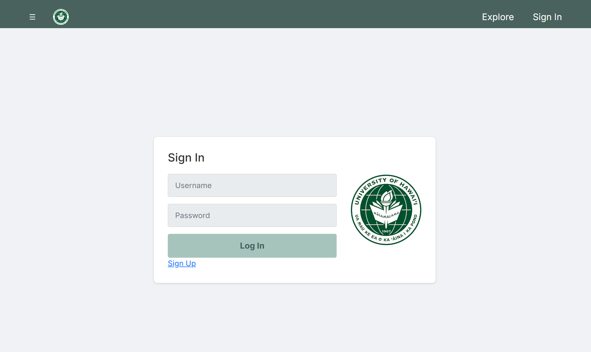
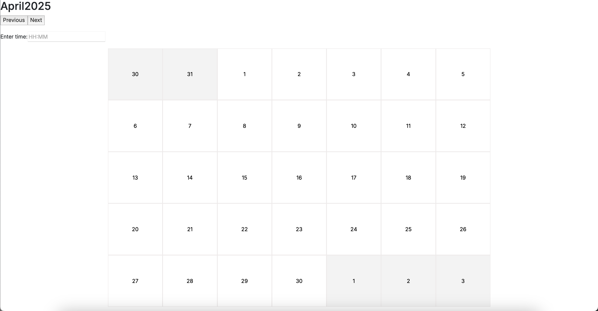

# Gym-Meet

## Table of contents

* [Overview](#overview)
* [Developer Guide](#developer-guide)
* [User Guide](#user-guide)


## Team
Gym Buddies is designed, implemented, and maintained by John Yamamoto, Jarell Ballesteros, Kathryn Nakagawa, Kimberly Nguyen, Raine Mendoza.

[Team Contract](https://docs.google.com/document/d/1vLohLOMnnn7a7mI3A0naIYsxXPSLakaRsPm0aQS7NiY/edit?tab=t.0)


## Deployment

Here is our deployed [application.](https://gym-buddy-five.vercel.app/)

## CI Badge


## Milestones

[Milestone 1](https://github.com/orgs/gym-meet/projects/2)

[Milestone 2](https://github.com/orgs/gym-meet/projects/7) 


## Overview

### The Problem
For many university students, their first introduction to the gym is the Rec Center. They want to be more active but are too intimidated to go to the gym alone. They are discouraged by their lack of experience and knowledge of the machines, as well as the fear making mistakes and injuring themselves. To overcome this, they opt to invite their friends to come along with them. But oftentimes their schedules don’t match up, which deters them from going.

### Our Solution
Our gym-meet app allows students to connect with others according to their workout needs and go to the gym together. Students will create their own customizable profile with their weekly gym times, frequent exercises, experience level, and more! They will then be able to match and meet with other people who have similar schedules, skill level, and workout preferences, and feel more comfortable going to the gym with a buddy! We hope this will also foster a greater sense of campus community by bringing together students who wouldn't normally interact and get to know people across different majors.


## Developer Guide

This section provides information of interest to developers wishing to use this code base as a basis for their own development tasks.

### Installation

First, [install Nextjs](https://nextjs.org/docs/app/getting-started/installation)

Second, visit the [Gym Buddy application GitHub page](https://github.com/gym-meet/gym-buddy), and click the green "<> Code" button to retrieve the link to clone the repo onto your local.

Third, cd into the gym-buddy directory and install libraries with:

```
$ npm install
```

Fourth, run the project with:
```
$ npm run dev
```

If all goes well, the application will appear at http://localhost:3000.

### Application Design

Gym Buddy is built upon [nextjs-application-template](https://github.com/ics-software-engineering/nextjs-application-template). Please use the videos and documentation at those sites to better acquaint yourself with the basic application design and form processing in Gym Buddy.

### Data model

The Gym Buddy data model consists of one "primary" collection: Profiles. To understand this design choice, consider the situation where you want to specify the characteristics of a Profile.

### Quality Assurance

#### ESLint

Gym Buddy includes a [.eslintrc.json](https://github.com/gym-meet/gym-buddy/blob/main/.eslintrc.json) file to define the coding style adhered to in this application. You can invoke ESLint from the command line as follows:

```
$ npm run lint
```

ESLint should run without generating any errors.

#### End to End Testing

Gym Buddy uses Playwright to provide automated end-to-end testing.

### Continuous Integration

Gym Buddy uses [GitHub Actions](https://docs.github.com/en/free-pro-team@latest/actions) to automatically run ESLint and Playwright each time a commit is made to the default branch. You can see the results of all recent "workflows" at https://github.com/gym-meet/gym-buddy/actions.

### Deployment

Gym Buddy uses [Vercel](https://vercel.com) to deploy new versions of the project. To deploy your version of the project, fork the repo into your own GitHub profile, develop in that fork, then start a new project in Vercel and connect it to your forked repo.

## User Guide
The first page you're introduced to is the landing page, with it's main purpose being to guide you to the signup/sign in and explore pages. You can view the explore page even if you don't have an account, but you cannot befriend others until you sign in or create an account yourself.


Depending on whether or not you have an account, you will be directed to the signup or sign in pages. If you're signing up, the page will ask you to confirm your password before it logs your information into the database. 


If you're signing in, it will only ask for your username and password before logging you into your account.



After successfully logging in (or creating an account), you will be directed to the home page. Here, there's a brief description on what the app is about, and you'll have easy access to your profile page, the explore page, and calendar feature. Let's take a look at the profile page first.


You profile page is the place to customize your experience at gym meet to the fullest. You can update your username and password, list social media and any contact information you feel comfortable sharing, select what days out of the week you prefer to go to the gym and specific filters such as preferred exercises, experience, and gender. This ensures that you match with people who fit your routine and workout needs.


Next is the explore page, where you can browse through other people's gym meet accounts. Filter based on exercises, scheduling and more to find people with similar preferences and matching times. Then you can send friend requests and schedule to meet with them.


Finally, we have the calendar page. This is a separate page that displays when you and your friends are going to the gym throughout the month. Here you can easily coordinate meetups at the gym and even add extra workout days that aren't listed in your weekly routine!


